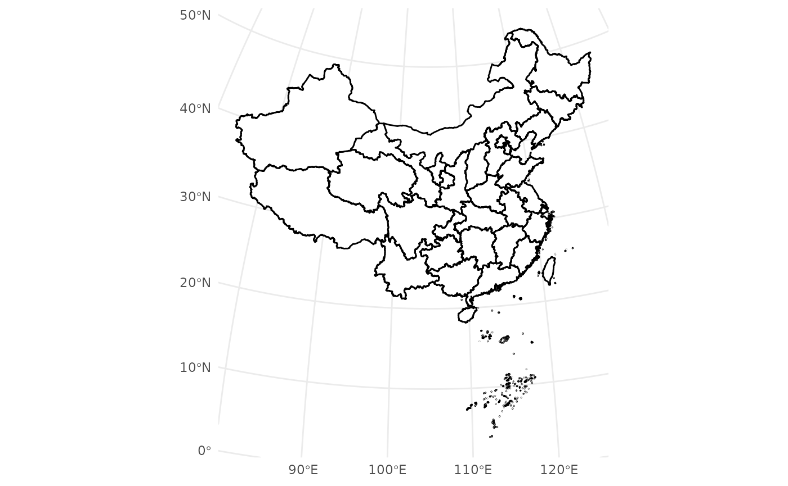

# Adding_Basic_Map

``` r
library(ggmapcn)
#> Loading required package: ggplot2
# Define Azimuthal Equidistant projection centered on China
china_proj <- "+proj=aeqd +lat_0=35 +lon_0=105 +ellps=WGS84 +units=m +no_defs"
```

## Introduction

The ggmapcn package provides various tools for visualizing geographic
data in China and beyond. This vignette demonstrates the basic and
advanced usage of
[`geom_mapcn()`](https://rimagination.github.io/ggmapcn/reference/geom_mapcn.md)
and
[`geom_world()`](https://rimagination.github.io/ggmapcn/reference/geom_world.md)
for plotting administrative boundaries and combining geographic data.

## Example 1: Basic Map of China

To draw a simple map of China with provincial boundaries, use
[`geom_mapcn()`](https://rimagination.github.io/ggmapcn/reference/geom_mapcn.md).
By default, it uses an Azimuthal Equidistant projection centered on
China.

``` r
ggplot() +
  geom_mapcn() +
  geom_boundary_cn() +
  theme_bw()
```



## Example 2: Adding Buffer Zones and Coastlines

This example illustrates how to layer multiple geographic features—such
as mainland buffers, coastlines, and administrative boundaries—onto a
single map.

``` r
ggplot() +
  geom_buffer_cn(mainland_dist = 40000) +
  geom_buffer_cn(mainland_dist = 20000, fill = "#BBB3D8") +
  geom_mapcn(fill = "white") +
  geom_boundary_cn() +
  theme_bw()
#> Warning: attribute variables are assumed to be spatially constant throughout
#> all geometries
#> Warning: attribute variables are assumed to be spatially constant throughout
#> all geometries
```


## Example 3: Adding Spatial Point Data

The `geom_loc` function allows you to overlay spatial point data onto
your map. It supports both `sf` objects and `data frames` containing
longitude and latitude columns, and can map aesthetics like color to
categorical variables.

``` r
# Create a ggplot with spatial points colored by 'Category'
set.seed(123)
data_sim <- data.frame(
   Longitude = runif(100, 80, 120),
   Latitude = runif(100, 28, 40),
   Category = sample(c("Type A", "Type B", "Type C"), 100, replace = TRUE)
   )
ggplot() +
   geom_boundary_cn() +
   geom_loc(
     data = data_sim, lon = "Longitude", lat = "Latitude",
     mapping = aes(color = Category), size = 1, alpha = 0.7
   ) +
   theme_bw()
```


## Example 4: basemap_vege: Vegetation Map of China Layer for ggplot2

Before using the function, ensure that the necessary data files are
available by running:

``` r
# This function checks if the required data files are available
# It may take some time, especially if your network connection is slow.
  check_geodata(files = c("vege_1km_projected.tif"), quiet = FALSE)
```

The `basemap_vege` function adds a vegetation raster map of China with
color-coded vegetation types to a ggplot.

``` r
# Add vegetation raster of China to a ggplot
ggplot() +
  basemap_vege() +
  guides(fill = guide_none()) +
  theme_bw()
```

## Example 5: basemap_dem: Elevation Map of China Layer for ggplot2

The `basemap_dem` function adds a digital elevation model (DEM) raster
map of China as a layer to ggplot2.

``` r
# Apply Azimuthal Equidistant projection centered on China
ggplot() +
  basemap_dem(crs = china_proj, within_china = TRUE) +
  geom_boundary_cn(crs = china_proj) +
  tidyterra::scale_fill_hypso_c(
    palette = "dem_print",
    breaks = c(0, 2000, 4000, 6000),
    limits = c(0, 7000)
  ) +
  labs(fill = "Elevation (m)") +
  theme_minimal() +
  theme(legend.position = "bottom")
#> <SpatRaster> resampled to 1000968 cells.
```


## Example 6: coord_proj: Transforming Limits for Custom Projections

The `coord_proj` function simplifies working with custom projections. It
accepts map limits (xlim, ylim) in standard WGS84 longitude/latitude
coordinates and automatically transforms them into the specified CRS.

Here, the Azimuthal Equidistant projection centered on China is applied,
with transformed map limits specified in longitude and latitude.

``` r
ggplot() +
  geom_mapcn(fill = "white") +
  geom_boundary_cn() +
  coord_proj(
    crs = china_proj,
    xlim = c(60, 140),
    ylim = c(10, 50)
  ) +
  theme_bw()
```


Additionally, we can focus the map on the South China Sea Islands. The
longitude and latitude range shown here is for demonstration purposes
only.

``` r
ggplot() +
  geom_mapcn(fill = "white") +
  geom_boundary_cn() +
  theme_bw() +
  coord_proj(
    crs = china_proj,
    expand = FALSE,
    xlim = c(105, 126),
    ylim = c(2, 23)
  )
```


