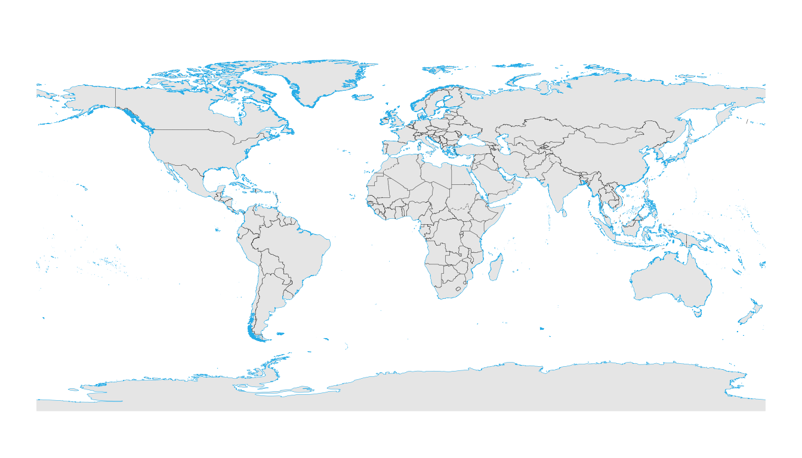
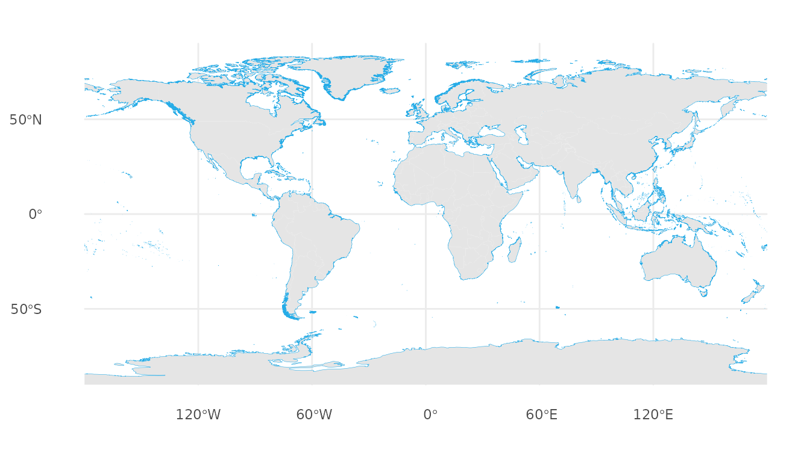
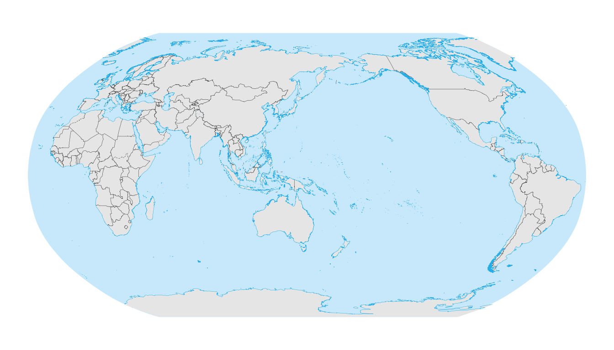
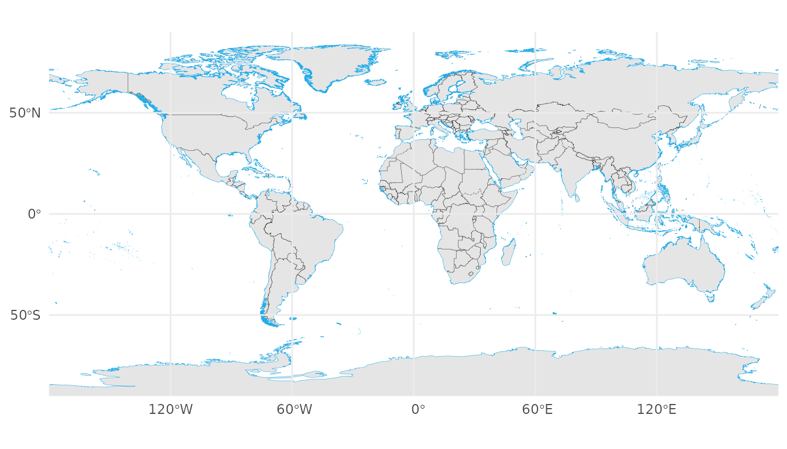
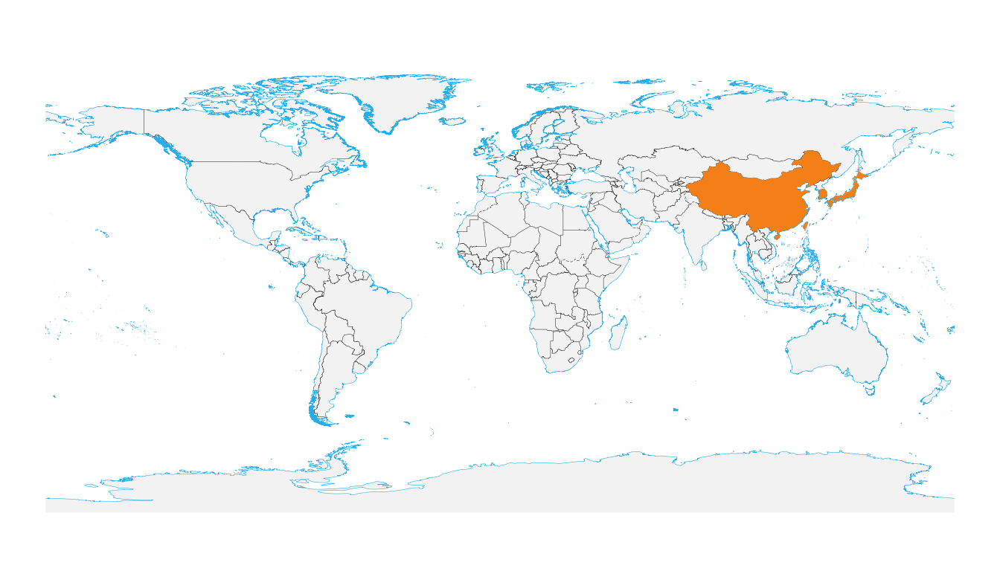

# World map overview with geom_world()

## 1. Introduction

[`geom_world()`](https://rimagination.github.io/ggmapcn/reference/geom_world.md)
provides a convenient global basemap for `ggplot2`.  
It uses bundled country polygons, coastlines, and
political/administrative boundaries, and automatically handles CRS
transformation and antimeridian splitting.

------------------------------------------------------------------------

## 2. Basic usage

### 2.1 Default WGS84 map

``` r
ggplot() +
  geom_world() +
  theme_void()
#> Warning: geom_world() has been redesigned; its interface and defaults have
#> changed compared to earlier development versions. See ?geom_world for details.
```



### 2.2 Explicit CRS specification

``` r
ggplot() +
  geom_world(crs = 4326) +
  coord_sf(crs = 4326) +
  theme_void()
```


### 2.3 Hiding the ocean layer

``` r
ggplot() +
  geom_world(
    show_ocean   = FALSE,
    country_fill = "grey90"
  ) +
  theme_minimal()
```


### 2.4 Hiding administrative boundaries

``` r
ggplot() +
  geom_world(
    show_admin_boundaries = FALSE,
    country_fill          = "white"
  ) +
  theme_minimal()
```


Combining both:

``` r
ggplot() +
  geom_world(
    show_ocean            = FALSE,
    show_admin_boundaries = FALSE
  ) +
  theme_minimal()
```



------------------------------------------------------------------------

## 3. Projections

### 3.1 Robinson projection

``` r
crs_robin <- "+proj=robin +datum=WGS84"

ggplot() +
  geom_world(crs = crs_robin) +
  coord_sf(crs = crs_robin) +
  theme_void()
#> Spherical geometry (s2) switched off
#> Spherical geometry (s2) switched on
```


### 3.2 Robinson projection centred at 150°E

``` r
crs_robin_150 <- "+proj=robin +lon_0=150 +datum=WGS84"

ggplot() +
  geom_world(crs = crs_robin_150) +
  coord_sf(crs = crs_robin_150) +
  theme_void()
#> Spherical geometry (s2) switched off
#> Spherical geometry (s2) switched on
```



### 3.3 Geographic CRS with shifted central meridian

``` r
crs_wgs84_150 <- "+proj=longlat +datum=WGS84 +lon_0=150"

ggplot() +
  geom_world(crs = crs_wgs84_150) +
  coord_sf(crs = crs_wgs84_150) +
  theme_void()
```


------------------------------------------------------------------------

## 4. Axis labels and gridlines

[`coord_sf()`](https://ggplot2.tidyverse.org/reference/ggsf.html) may
show gridlines but hide axis labels.  
This often occurs when:

- `expand = TRUE` extends the map beyond ±180° or ±90°  
- the CRS lacks a geographic `datum`  
- layers (e.g., ocean polygons) are drawn above the panel grid

**Recommended pattern for reliable axis labels:**

    coord_sf(
      crs    = 4326,
      expand = FALSE,
      datum  = sf::st_crs(4326)
    ) +
    theme(panel.ontop = TRUE)

Example:

``` r
ggplot() +
  geom_world() +
  coord_sf(
    crs    = 4326,
    expand = FALSE,
    datum  = sf::st_crs(4326)
  ) +
  theme_minimal() +
  theme(panel.ontop = TRUE)
```



------------------------------------------------------------------------

## 5. Graticule annotation (meridians & parallels)

[`annotation_graticule()`](https://rimagination.github.io/ggmapcn/reference/annotation_graticule.md)
draws meridians and parallels as annotation layers.  
The graticules are:

- generated in WGS84 (EPSG:4326)  
- optionally split at the antimeridian  
- then transformed to the map CRS

This gives full control over:

- line spacing (`lon_step`, `lat_step`)  
- label placement  
- behaviour under different projections  
- regional windows defined by `xlim`/`ylim`

### 5.1 Global WGS84 map with graticules

``` r
ggplot() +
  geom_world() +
  annotation_graticule(
    lon_step     = 60,
    lat_step     = 30,
    label_offset = 5
  ) +
  coord_sf(
    crs    = 4326,
    expand = FALSE,
    datum  = sf::st_crs(4326)
  ) +
  theme_void() +
  theme(panel.ontop = TRUE)
#> Spherical geometry (s2) switched off
#> Spherical geometry (s2) switched on
```


### 5.2 Robinson projection

``` r
crs_robin <- "+proj=robin +datum=WGS84"

ggplot() +
  geom_world(crs = crs_robin) +
  annotation_graticule(
    crs          = crs_robin,
    lon_step     = 30,
    lat_step     = 15,
    label_offset = 3e5
  ) +
  coord_sf(crs = crs_robin) +
  theme_void()
#> Spherical geometry (s2) switched off
#> Spherical geometry (s2) switched on
#> Spherical geometry (s2) switched off
#> Spherical geometry (s2) switched on
```


### 5.3 Regional China map (clean axis labels)

This is the recommended pattern for regional maps:

- show **graticule lines** only (`label_color = NA`)  
- show **axis labels** via
  [`labs()`](https://ggplot2.tidyverse.org/reference/labs.html)  
- keep the region exact with `expand = FALSE`

``` r
cn_xlim <- c(70, 140)
cn_ylim <- c(0, 60)

ggplot() +
  geom_world() +
  annotation_graticule(
    xlim         = cn_xlim,
    ylim         = cn_ylim,
    crs          = 4326,
    lon_step     = 10,
    lat_step     = 10,
    label_color  = NA,
    label_offset = 1,
    label_size   = 3.5
  ) +
  coord_sf(
    xlim   = cn_xlim,
    ylim   = cn_ylim,
    expand = FALSE
  ) +
  labs(
    x = "Longitude",
    y = "Latitude"
  ) +
  theme_bw()
#> Spherical geometry (s2) switched off
#> Spherical geometry (s2) switched on
```


------------------------------------------------------------------------

## 6. Highlighting selected countries

### 6.1 Highlighting China

``` r
ggplot() +
  geom_world(
    country_fill = "white",
    show_frame   = TRUE
  ) +
  geom_world(
    filter_attribute = "SOC",
    filter           = "CHN",
    country_fill     = "red"
  ) +
  theme_void()
```


### 6.2 Highlighting multiple countries

``` r
focus <- c("CHN", "JPN", "KOR")

ggplot() +
  geom_world(
    country_fill = "grey95",
    show_frame   = TRUE
  ) +
  geom_world(
    filter_attribute = "SOC",
    filter           = focus,
    country_fill     = "#f57f17"
  ) +
  theme_void()
```



------------------------------------------------------------------------

## 7. Summary

This vignette introduced how to:

- draw global maps using
  [`geom_world()`](https://rimagination.github.io/ggmapcn/reference/geom_world.md)  
- control ocean and administrative boundary layers  
- work with different projections  
- avoid missing axis labels in
  [`coord_sf()`](https://ggplot2.tidyverse.org/reference/ggsf.html)  
- add custom meridians/parallels with
  [`annotation_graticule()`](https://rimagination.github.io/ggmapcn/reference/annotation_graticule.md)  
- highlight individual or groups of countries
