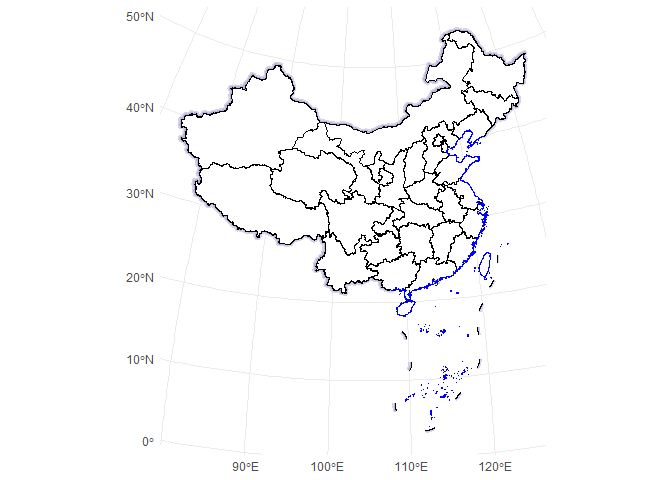

# ggmapcn

`ggmapcn` is a `ggplot2` extension package for visualizing China’s map
with customizable projections and styling. This package includes
province-level map data and supports adding mainland borders,
coastlines, and buffer areas, making it easy to create geographic
visualizations of China.

# Installation

Install the development version of ggmapcn from GitHub with:

``` r
# install.packages("devtools")
devtools::install_github("Rimagination/ggmapcn", force = TRUE)
```

# Usage

## Plotting a Map of China

To plot a map of China with province boundaries, use
[`geom_mapcn()`](https://rimagination.github.io/ggmapcn/reference/geom_mapcn.md):

``` r
library(ggplot2)
library(ggmapcn)

ggplot() +
  geom_mapcn() +
  geom_boundary_cn()+
  theme_minimal()
```


## Custom Projection and Styling

If you want to try the Albers projection, you can customize it.

``` r
ggplot() +
  geom_mapcn(crs = "+proj=aea +lat_1=25 +lat_2=47 +lat_0=0 +lon_0=105 +x_0=0 +y_0=0 +datum=WGS84 +units=m +no_defs", color = "black", fill = "white", size = 0.7) +
  geom_boundary_cn()+
  theme_bw()
```


## Adding Mainland Borders and Coastlines

Use
[`geom_boundary_cn()`](https://rimagination.github.io/ggmapcn/reference/geom_boundary_cn.md)
to add mainland borders and coastlines to the map. You can set colors
and line widths for both the mainland and coastline boundaries:

``` r
ggplot() +
  geom_mapcn(fill = NA) +
  geom_boundary_cn(
    mainland_color = "black",
    mainland_size = 0.5,
    coastline_color = "skyblue",
    coastline_size = 0.5
  ) +
  theme_bw()
```


## Adding Buffer Zones

The
[`geom_buffer_cn()`](https://rimagination.github.io/ggmapcn/reference/geom_buffer_cn.md)
function adds buffer zones around China’s borders. You can specify
buffer distances, colors, and projections. The example below shows
buffer zones with varying distances:

``` r
ggplot() +
  geom_buffer_cn(mainland_dist = 40000) +
  geom_buffer_cn(mainland_dist = 20000, fill = "#BBB3D8") +
  geom_mapcn(fill = "white") +
  geom_boundary_cn() +
  theme_bw()
#> Warning: attribute variables are assumed to be spatially constant throughout
#> all geometries
#> Warning: attribute variables are assumed to be spatially constant throughout
#> all geometries
```



## Basic world map in WGS84

This example displays a simple world map using the standard WGS84
geographic coordinate system (EPSG:4326), with country boundaries
rendered by
[`geom_world()`](https://rimagination.github.io/ggmapcn/reference/geom_world.md).

``` r
ggplot() +
  geom_world(show_ocean=FALSE) +
  theme_bw()
```


## Data Source

The administrative boundary data for China is sourced from **Tianditu**
(<https://cloudcenter.tianditu.gov.cn/administrativeDivision/>), a
national geographic information platform that provides authoritative
province-, city-, and county-level divisions. This data has been
processed into GeoJSON format to ensure compatibility and ease of use
within the package.

The global (world) administrative boundary data, on the other hand, is
developed by our team. It has been curated and simplified to support
consistent cartographic styling and efficient rendering alongside the
China-specific layers.

# Learn More

If you’d like to explore more advanced features—such as adding elevation
or vegetation layers, overlaying point data, or working with custom
projections—check out the **Articles**.
